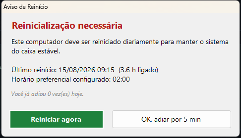
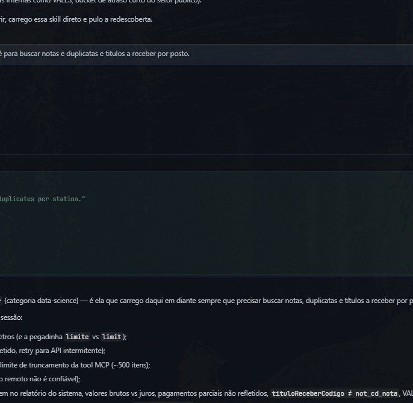

# Aviso de Reinício

> Lembrete diário de reinício para computadores de caixa (PDV) no Windows.
> **Desenvolvido por Scursel** — projeto open source sob a licença MIT.

O **Aviso de Reinício** fica na bandeja do sistema e, todos os dias no horário
configurado (padrão **02:00**), abre um pop-up pedindo para reiniciar o
computador. Se o funcionário estiver atendendo, ele clica em **"OK, adiar"** e
o aviso volta depois de alguns minutos — repetindo **até o computador ser
reiniciado**. Depois do reinício, o programa para de incomodar até o dia
seguinte.

[](LICENSE)
[](https://github.com/scursel/aviso-de-reinicio/releases)
[](https://github.com/scursel/aviso-de-reinicio/releases)

Não precisa de administrador, não precisa instalar nada: é um único `.exe`
que usa o .NET Framework que já vem no Windows 10/11.

---

## Funcionalidades

- ✅ Pop-up diário no horário preferencial (padrão 02:00, configurável)
- ✅ Botão **"OK, adiar"** → o aviso volta após X minutos (padrão 5, configurável 1–120)
- ✅ O aviso **não some até reiniciar** (não tem X para fechar)
- ✅ **"Reiniciar agora"** reinicia o Windows em 10 segundos
- ✅ Tela de configurações com horário, adiamento, reinício forçado opcional e início automático
- ✅ **Reinício forçado opcional**: após N adiamentos no mesmo dia, abre contagem de 60 s e reinicia sozinho
- ✅ **Log completo** (CSV, abre no Excel): cada pop-up, cada "OK", o pedido de reinício e o horário exato em que o PC voltou
- ✅ Se o PC estava desligado na hora do aviso, ele aparece logo depois que alguém ligar
- ✅ Se o PC já foi reiniciado no dia, não incomoda de novo
- ✅ Sempre por cima das outras janelas (inclusive do PDV) + som de alerta
- ✅ Isenção por máquina via arquivo `DesativarAviso.txt`
- ✅ Rede de segurança: tarefa agendada relança o programa no logon se ele for fechado

## Capturas de tela

**Pop-up diário** — fica sempre por cima das outras janelas e não tem X para fechar:



**Tela de configurações** — horário, adiamento, reinício forçado, estatísticas e log:



## Instalação

1. Baixe o instalador (`Instalador-AvisoDeReinicio-*.exe`) na página de
   [Releases](https://github.com/scursel/aviso-de-reinicio/releases) (ou compile
   o seu, veja abaixo).
2. Execute o instalador (não precisa de administrador).
3. Marque "Iniciar automaticamente com o Windows" (recomendado).
4. Pronto: o ícone azul aparece na bandeja, ao lado do relógio.

Também dá para usar o `AvisoDeReinicio.exe` direto (portátil): dois cliques e
ele já funciona, sem instalar nada.

### Via winget

```
winget install Scursel.AvisoDeReinicio
```

*(disponível assim que o manifesto for aprovado no repositório
[microsoft/winget-pkgs](https://github.com/microsoft/winget-pkgs))*

### Via Chocolatey

O pacote está pronto em [`chocolatey/`](chocolatey/) — para publicar no
repositório da comunidade:

```
choco pack chocolatey\aviso-de-reinicio.nuspec
choco push aviso-de-reinicio.1.0.1.nupkg --api-key SUA_CHAVE
```

## Uso

- **Configurar**: clique com o botão direito no ícone azul da bandeja →
  "Abrir configurações" (ou clique duas vezes no ícone).
- **Testar**: menu do ícone → "Testar pop-up agora".
- **Ver o log**: tela de configurações (tabela + estatísticas) ou o arquivo
  `%APPDATA%\AvisoDeReinicio\log.csv`.

### Regras do lembrete

| Situação | Comportamento |
|---|---|
| Hora marcada chega (ex.: 02:00) | Pop-up aparece |
| Funcionário clica "OK, adiar" | Volta após X minutos (sem limite de vezes) |
| Funcionário clica "Reiniciar agora" | Reinicia em 10 s e registra no log |
| PC estava desligado às 02:00 | Aviso aparece logo após ligar (se ainda não reiniciou no dia) |
| PC já reiniciado no dia (até 2 h antes do horário) | Não incomoda |
| N adiamentos no mesmo dia (se "forçar" estiver ligado) | Contagem de 60 s e reinício automático |

### Log (CSV)

Colunas: `DataHora ; Evento ; Detalhe`

Eventos: `SESSAO_INICIADA`, `POPUP_EXIBIDO`, `OK_CLICADO`, `REINICIO_SOLICITADO`,
`REINICIO_CONCLUIDO` (com o horário do boot), `CONTAGEM_FORCADA`,
`CONFIG_ALTERADA`, `AVISOS_DESATIVADOS`.

### Máquina isenta

Crie um arquivo vazio `DesativarAviso.txt` em `%APPDATA%\AvisoDeReinicio`.
O programa continua rodando (e logando), mas não mostra pop-ups.
Apague o arquivo para voltar a avisar.

### Desinstalar

Painel de Controle → Programas → "Aviso de Reinício" → Desinstalar.
(Remove o programa, o início automático, a tarefa agendada e os atalhos.
Os logs ficam em `%APPDATA%\AvisoDeReinicio` — apague a pasta se quiser
remover tudo.)

## Compilar do código-fonte

Requisitos: Windows 10/11 (nada mais — usa o compilador `csc.exe` que já vem
no sistema). Para gerar o instalador: [Inno Setup](https://jrsoftware.org) 6.7+.

```
:: gera o AvisoDeReinicio.exe
build.bat

:: gera o instalador (saida\Instalador-*.exe)
ISCC.exe instalador.iss
```

Flags de desenvolvimento: `AvisoDeReinicio.exe --demo` (abre o pop-up sozinho)
e `--selftest` (grava um log de teste e sai).

## Estrutura do repositório

```
AvisoDeReinicio.cs   -> código-fonte completo (C# / WinForms, .NET Framework 4.x)
build.bat            -> compila o .exe com o csc.exe do Windows
instalador.iss       -> script do instalador (Inno Setup, pt-BR, sem admin)
make-icon.ps1        -> gera o app.ico (círculo azul com seta de reinício)
registrar-tarefa.ps1 -> cria a tarefa agendada de backup no logon
app.ico              -> ícone do programa
```

## Licença

[MIT](LICENSE) — use, modifique e distribua livremente.

---

*Desenvolvido por Scursel.*